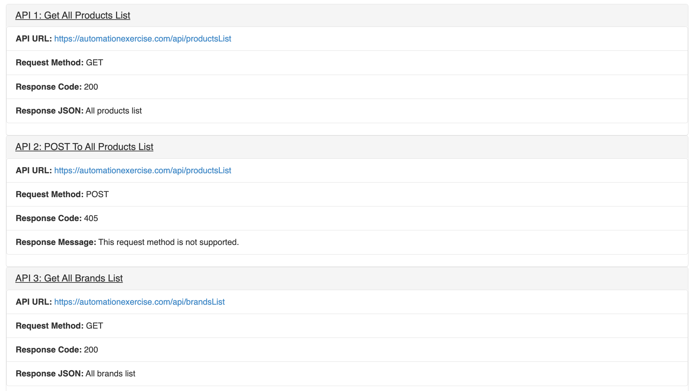
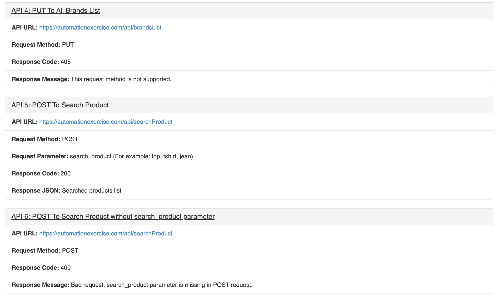
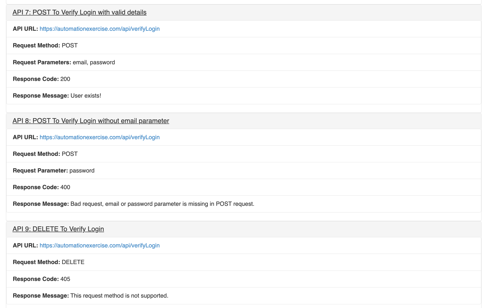
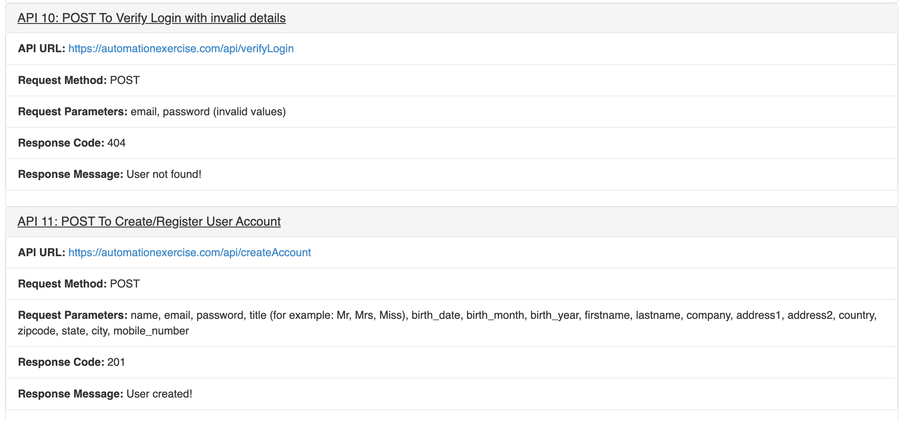
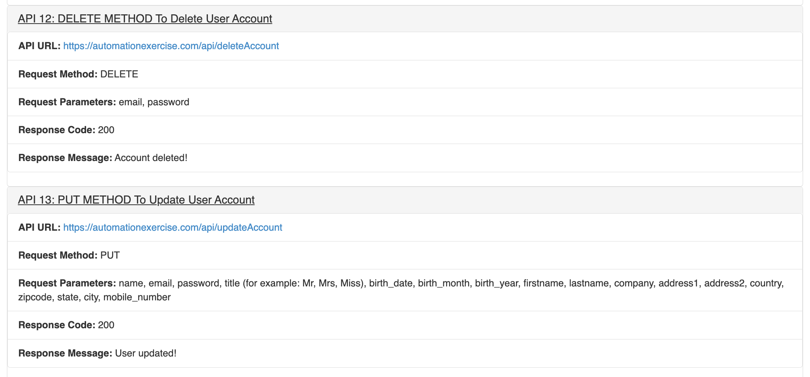
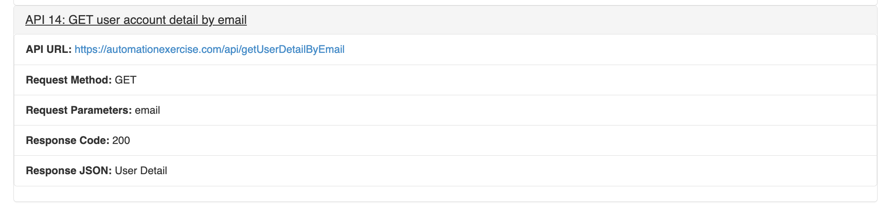

# API-Automation-Scripts

Welcome to the **API-Automation-Scripts** repository! This project contains automated scripts for validating various API functionalities, including endpoint testing, handling request parameters, and response validation. The repository uses the Page Object Model (POM) for structured and maintainable test automation.

## Table of Contents

- [Features](#features)
- [Requirements](#requirements)
- [Setup](#setup)
  - [Clone the Repository](#clone-the-repository)
  - [Create a Python Virtual Environment](#create-a-python-virtual-environment)
  - [Install Python Dependencies](#install-python-dependencies)
  - [Configure Your Tests](#configure-your-tests)
  - [Run API Tests](#run-api-tests)
  - [Review Reports](#review-reports)
- [API Images](#api-images)
- [Directory Structure](#directory-structure)
- [License](#license)
- [Contributing](#contributing)
- [Contact](#contact)

## Features

- **Endpoint Testing**: Validate various API endpoints to ensure they are functioning correctly.
- **Request Parameters Handling**: Test different request parameters to verify API robustness and flexibility.
- **Response Validation**: Confirm that API responses are accurate and meet expected standards.
- **Page Object Model (POM)**: Utilize POM to structure and maintain test automation scripts for better readability and scalability.
- **Comprehensive Reporting**: Generate detailed reports to analyze API performance and identify issues.
- **Customizable Configurations**: Easily adjust testing parameters and scenarios to match your API requirements.

## Requirements

- **Python**: Required for running automated test scripts.
- **pytest**: Framework for running Python tests and generating reports.
- **Requests Library**: For making HTTP requests in Python tests.

## Setup

### Clone the Repository

```bash
git clone https://github.com/Only1JohnN/API-automation-scripts.git
cd API-automation-scripts
```

### Create a Python Virtual Environment

To avoid conflicts between dependencies, it's recommended to use a virtual environment. Create one using `venv` with either `python` or `python3`:

```bash
# Use either python or python3
python -m venv venv
# or
python3 -m venv venv
```

#### Activating the Virtual Environment:

- **On Windows:**

    ```bash
    venv\Scripts\activate
    ```

- **On macOS/Linux:**

    ```bash
    source venv/bin/activate
    ```

### Install Python Dependencies

Install the required Python packages listed in `requirements.txt`:

```bash
pip install -r requirements.txt
```

### Configure Your Tests

- **Test Scripts**: Update test scripts in the `tests` folder to configure endpoints, request parameters, and expected responses. Modify `api_tests.py` as needed.
- **Page Object Model (POM)**: Review and update the POM classes defined in the `pages` folder to reflect the API endpoints and actions relevant to your tests.

### Run API Tests

Execute Python tests using `pytest`:

```bash
pytest tests/api_tests.py
```

### Review Reports

Review the test execution logs to assess API functionality and identify issues. Logs are saved in the logs folder, as logging is enabled for detailed analysis of test outcomes.

## API Images

Here are some images illustrating the API functionalities:

### Tab Bar


### API 1-3



### API 4-6



### API 7-9



### API 10-11



### API 12-13



### API 14



## Directory Structure

- **`pages/`**: Contains POM classes used for structuring API test automation.
  - `page_objects.py`: Defines Page Object Model classes for API interactions.

- **`tests/`**: Contains test scripts for API validation.
  - `api_tests.py`: Python script for validating various API functionalities.

- **`results/`**: Directory where test results are saved.
  - `test_results.log`: Log file for test results.

- **`requirements.txt`**: Lists Python dependencies required for test scripts.

## License

This project is licensed under the MIT License. For usage or redistribution, please contact me for permission.

## Contributing

Contributions are welcome! Please fork the repository and submit a pull request (PR) adhering to the project's coding standards and including appropriate tests. Open issues or PRs to discuss and review changes.

## Contact

For any questions, feedback, or collaboration inquiries, please reach out to Adeniyi John.

Thank you for using **API-Automation-Scripts**. We hope these tools help you ensure the reliability and performance of your APIs!